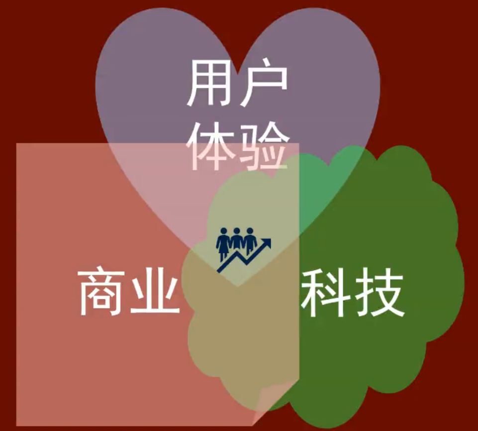
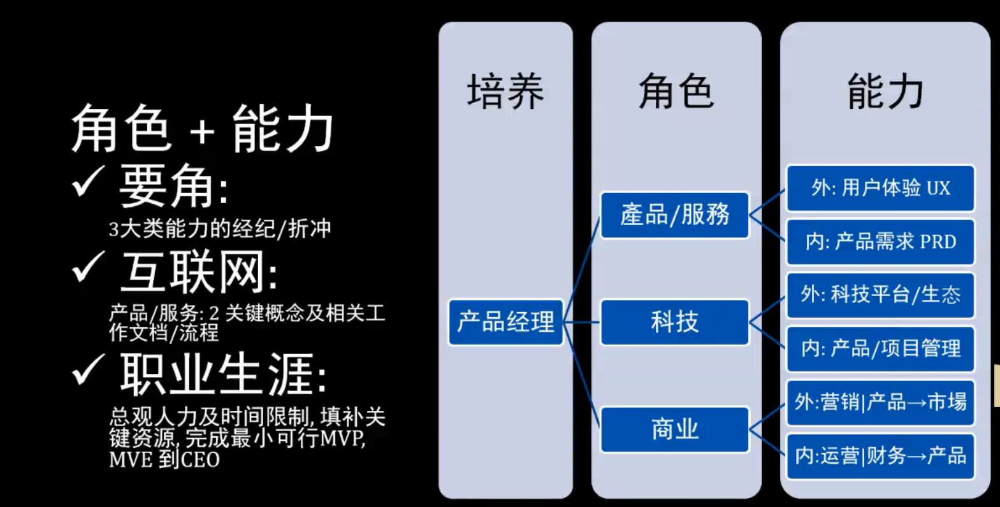

# Week01

*写在前面：本周主要介绍了产品经理需要有的“能力”、文档以及相关术语。*

> “感”体验，“通”需求，“出”设计

* “感”体验

用户体验UX（User Experience），去体验设计

感知 perceive

同理、共鸣 empathize

接受反馈 receive feedbacks

* “通”需求

产品需求PRD（Product Requirement Doc）

沟通需求 communicate

书写文档 write docs

* “出”设计

Design， 为某目标而将某事物、数据等做安排

价值主张 Value Propositions

设计思维 Design Thinking

设计冲刺 Design Sprint

> 为设计去感受用户与沟通需求

#### 以用户为中心的设计过程：

1.使用情景研究

2.用户需求具体化

3.设计出解决方案

4.根据“需求”来“评估”解决方案

5.遍历循环直到走出为止，才能符合需求

#### 将体验写成专业文档及出设计的过程：

1.通常最开始：BRD（商业需求文档）
     * 对象：老板或CEO
     * 主要与商业模式有关
     
2.通常中间：MRD（市场需求文档）
     * 对象：商务运营、市场人员
     * 主要和运营模式有关
     
3.通常最后：Prototype（原型）

4.通常三种需求文档最后：PRD（产品需求文档）
     * 对象：开发测试体验人员
     * 通常主要和产品需求界面、流程、功能相关
     
     
#### 三个准则：

用户体验准则 Desirability

科技可行性准则 Feasibility

商业可行性准则 Viability

* 最小可行性产品 MVP

* 最小可行性（平台）生态 MVE

*总结：设计要坚持“以人为本”，不要让自己的想法强加在用户身上。*

