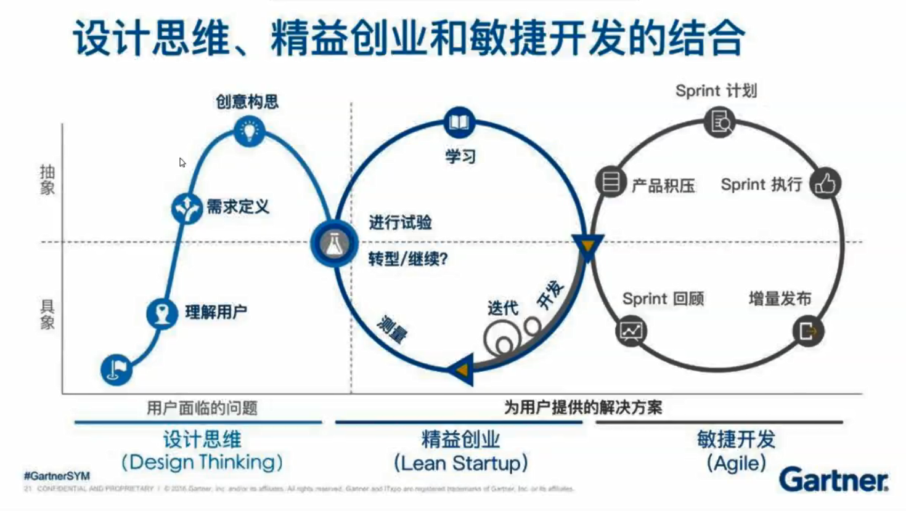

# Week02

> 让使用者最先想到你，你就赢了

本周主要内容为如何去编撰一个产品的文档，在我们对一个产品开始构想时不知道该如何入手时，可以采用AEIOU法去设想自己能够提问的问题，帮助自己顾全到所有方面，在对这些问题进行研究解决时，或许我们就能够找到切入点。

--------

#### AEIOU 法-取得用户的初步资讯

活动 Activities

   * 发生什麽事?
   
   * 大家在做什麽?
   
   * 他们的任务是什麽?
   
   * 他们执行的活动是什麽?
   
   * 活动前和活动後的状况如何?

环境 Environment

   * 环境看起来如何?
   
   * 空间的本质和功能为何?
   
交互/互动 Interaction
   
   * 系统之间如何互动?
   
   * 有任何介面吗?
   
   * 使用者彼此如何互动?

   * 运营自哪些环节所组成?

物件 Objects

   * 用到哪些物件和装置?
   
   * 谁使用这些物件?在哪个环境?
   
使用者/ User
   
   * 使用者是谁?
   
   * 使用者扮演什麽角色?
   
   * 使用者受谁的影响?

--------

钩瘾架构崇尚使用户“上瘾”、“习惯”于某产品，讲究的是用户投放在产品的时间。或许这种架构让人感觉丧失了创作产品的道德底线，但就商业利益而言，商人追逐的无不是用户对于产品的喜爱而不可释手。但无可否认的是，钩瘾架构目标实现的过程是我们应该学习的，怎么样去研究用户对于一个产品喜爱程度，即满意度，怎样设计产品才能使用户感到满意，是产品的最终归宿，我们都希望自己设计的产品能够得到用户的喜爱，用户时间的投入无不诠释着产品的好与坏。

--------
钩瘾架构（Hook Framework）

四个基础要素：

 * 触发（Trigger）丶行动（Action）丶奖励（Reward）和投入（Investment）
 
 * 触发（Trigger）分为内/外(用户认知心理之内/外)两种
 
可用于用户研究的理论框架，如问卷

--------

* 三个重要标准，即有效性（effectiveness），效率（efficiency）和满意度（satisfaction）。

有效性强调的是结果，在这里表示一个设计最终能够取得的成果。

效率注重的是一件事情实施的过程，做的是否为有用功，它是否不强求不必要的用户而外的努力？

满意度则指产品最终给用户带来的体验，是否能够使用户感到开心。

#### 设计的过程是循环渐进的。

> 相关书籍：

> 《设计思维》/《Design Thinking》--Tim Brown

> 《精益创业》/《Learn Start up》--Eric Ries

> 《设计冲刺》/《Design Sprint》--杰克.纳普

--------

参考链接：

[钩瘾效应](https://www.jianshu.com/p/2ae2549acc0d)

--------

