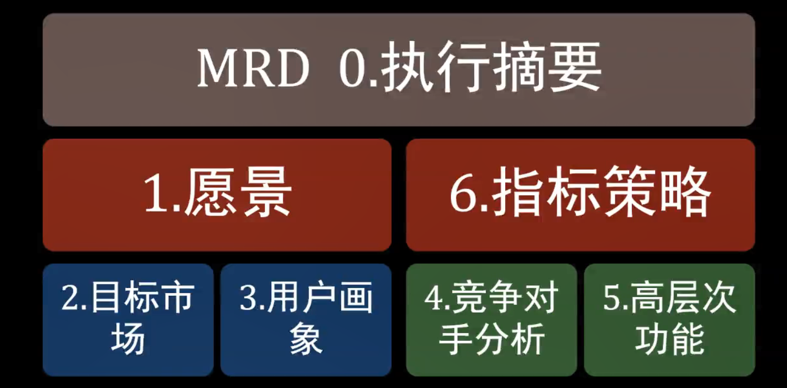

# Week03

> 有好的产品策略，你就比别人前进了一步。

------ 

策略要的现实掌握：

产业和市场区隔：从产业研究报告开始

产品目标市场规模：分事实及假设做铺垫

产品竞品分析：分析用户现有解决方案

产品用户洞察：描述用户新型解决方案

产品策略指标：衡量成功并完成MRD文档

------

产业（Sector ）大分类，主要指生产活动。类似于我们分的第一产业、第二产业、第三产业

产/行业（Industry） 商业模式。指从事相同性质的**经济活动**的所有单位的集合。比如：直播行业，游戏行业

市场（Market） 客户。市场指的是**某一客户群体**。有某行业提供产品及服务的**对象**

