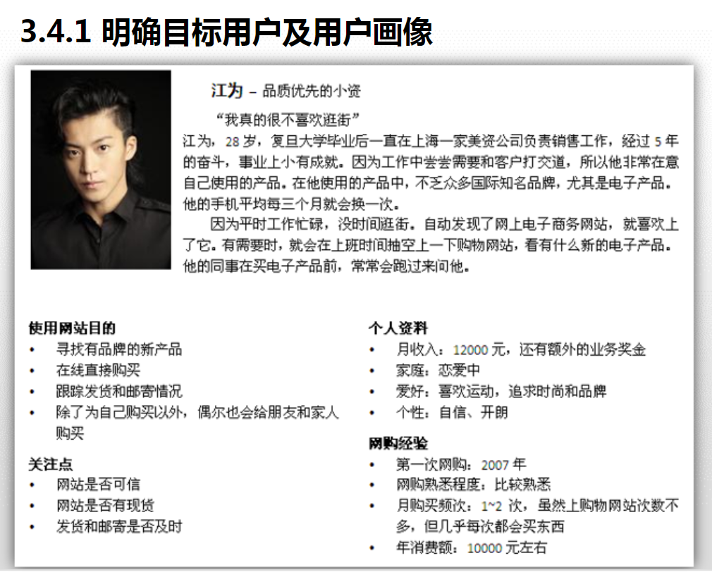

# MRD 产品竞品分析

> 了解目前市场规模，了解竞争对手优劣势，取其精华去其糟粕，升华自己的产品

* MRD书写框架

### 产品竞品分析

> 核心策略 + 产品设计 +产品定位分析

1.明确目标用户，制作用户画像

* 用户画像：虚拟的用户角色。

（1）常用用户特征（年龄，性别，出生日期，收入，职业，居住地，兴趣爱好，性格特征）

（2）用户名称

（3）用户技能（熟练地做某事，比如熟练使用电脑办公）

（4）与产品相关特征：
    
     a.电子商务产品：购买习惯，年度消费预算等
     
     b.交友类：是否单身，择偶标准
     
     c.游戏类：是否喜爱3D游戏，是否有同类型经验等
     
 示例图：
 
 

2.用户使用的场景，任务和需求

* 建完用户画像需把用户放到实际的使用场景（用户在某个环境中完成某个任务）

3.痛点和惯用的解决方案，探索使用的影响因素

4.验证评估和探索

* 对于需求点进行聚类

* 对痛点的解决方案进行探索

### 产品策略指标

> 评估指标

1.产品用户数指标
   
   a.DAU
   
   b.MAU
   
   c.新增用户数
   
   d.流失率/流失用户数
   
   e.回访用户数（之前卸载了又重新安装）
   
   f.下载总量
   
2.产品用户行为指标
   
   a.点击率
   
   b.转化率
   
   c.页面/产品停留时间（并不是时间越长越好，比如注册页面，时间过于长的话表明你的页面设置有问题）
   
   d.日均活跃时间
   
   e.评论，收藏，分享行为数据
   
单看d,e两者，可以看出，互联网所有产品都可能成为竞品，因为它在占用你的时间   

3.产品收益指标
   
   a.广告收益
   
   b.销售收益
   
   c.会员收益
 
 4.用户体验性指标
     
   a.愉悦感（Happiness）
   
   b.参与度（Engagement）
   
   c.接受度（Adoption）
   
   d.任务完成率（Task success）
   
  
### 产品策略指标的数据获取途径

1.企业内部数据
   
   a.DAU
   
   b.MAU
   
   c.点击率
   
   d.页面停留时长
   
   e.日均活跃时间
   
   f.下载量
   
   g.用户评论，分享，收藏数据
   
   h.用户网络行为数据
   
   
2.企业外部
       
   a.看在各大应用市场数据，了解市场规模和趋势（排行榜，下载量，评价等）
   
   b.在网站上浏览和爬取（个人社交网站分享，公共论坛留言）
   
   c.购买或自有数据（网站cookies，APP设备信息，基于用户行为形成用户标签和用户画像）
   
   
### 总结：

产品与用户息息相关，研究用户行为对于产品的发展有很大的影响，企业要利用好内部数据对产品进行改造升级

